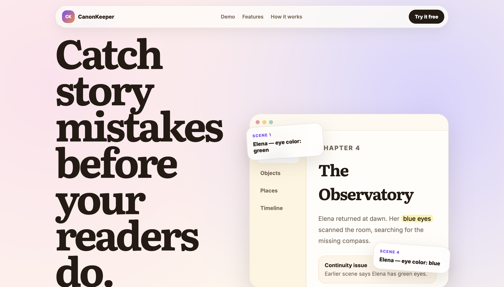
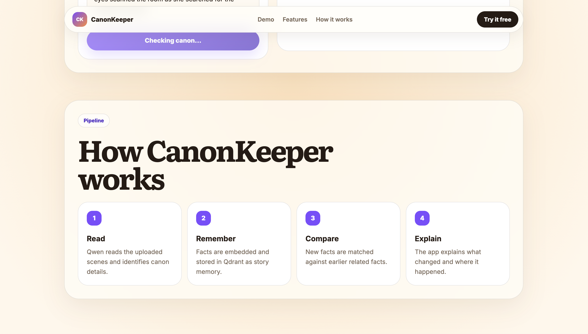

# CanonKeeper

CanonKeeper is an AI-powered continuity checker for fiction writers.

It analyzes story drafts, extracts canon facts, stores them in a vector database, and flags contradictions across scenes.

Example: if a character has green eyes in Scene 1 and blue eyes in Scene 3, CanonKeeper identifies the inconsistency, shows the conflicting quotes, and explains the issue.

## Features

- Upload story drafts for continuity analysis
- Extract structured facts from scenes
- Detect contradictions across character traits, object status, and story details
- Show source quotes for each conflict
- Use Qwen through Ollama for local LLM reasoning
- Use Qdrant for vector storage and retrieval
- Use Docling for document ingestion
- Modern React frontend with a clean writer-focused interface


## Live Demo

- Frontend: https://canon-keeper-frontend.vercel.app
- Backend API Docs: https://canon-keeper-backend.onrender.com/docs

The hosted demo uses a lightweight production profile for Render's free tier. It supports `.txt` and `.md` uploads online. The local development setup keeps Docling support for richer document ingestion.

## Screenshots

### Landing Page



### Workflow



## Demo Example

Sample input:

```text
Scene 1:
Elena entered the old observatory with green eyes shining under the moonlight.
She carried a silver compass given to her by her brother Marcus.

Scene 3:
Elena returned to the observatory at dawn.
Her blue eyes scanned the room as she searched for the missing compass.
```

CanonKeeper detects:

- Elena's eye color changes from green to blue.
- The silver compass is carried by Elena earlier, but later appears to be missing.

## Tech Stack

### Frontend

- React
- TypeScript
- Vite
- CSS

### Backend

- FastAPI
- Python 3.11
- Uvicorn
- Docling
- Ollama
- Qwen
- Qdrant
- python-dotenv

## AI Pipeline

```text
Story Upload
   ↓
Docling / Text Ingestion
   ↓
Fact Extraction with Qwen
   ↓
Embedding Generation with Ollama
   ↓
Vector Storage in Qdrant
   ↓
Contradiction Detection
   ↓
Continuity Report
```

## Local Setup

### Clone

```bash
git clone https://github.com/rajivsaicharan2004/canon-keeper.git
cd canon-keeper
```

### Backend

```bash
cd backend
python3.11 -m venv .venv
source .venv/bin/activate
pip install -r requirements.txt
```

Create `backend/.env`:

```env
QDRANT_URL=your_qdrant_cloud_url
QDRANT_API_KEY=your_qdrant_api_key
OLLAMA_BASE_URL=http://localhost:11434
LLM_MODEL=qwen3:8b
EMBED_MODEL=nomic-embed-text
FRONTEND_ORIGIN=http://localhost:5173
```

Start backend:

```bash
python -m uvicorn app.main:app --reload
```

Backend API docs:

```text
http://localhost:8000/docs
```

### Ollama

Install Ollama and pull the required models:

```bash
ollama pull qwen3:8b
ollama pull nomic-embed-text
```

### Frontend

In a second terminal:

```bash
cd frontend
npm install
npm run dev
```

Frontend runs at:

```text
http://localhost:5173
```

## Project Structure

```text
canon-keeper/
├── backend/
│   ├── app/
│   │   ├── main.py
│   │   ├── ingestion.py
│   │   ├── extraction.py
│   │   ├── detector.py
│   │   ├── vectors.py
│   │   ├── config.py
│   │   └── models.py
│   ├── eval/
│   └── requirements.txt
├── frontend/
│   ├── src/
│   ├── package.json
│   └── vite.config.ts
├── .env.example
├── .gitignore
└── README.md
```

## Current Status

CanonKeeper currently runs locally with:

- React frontend
- FastAPI backend
- Qwen via Ollama
- Qdrant Cloud
- Docling document ingestion

## Planned Improvements

- Hosted deployment
- User authentication
- Project-level story memory
- Timeline contradiction detection
- Exportable continuity reports
- Larger benchmark evaluation set

## Security

Secrets such as Qdrant API keys are stored locally in `.env` and excluded from Git through `.gitignore`.

Never commit:

```text
.env
backend/.env
frontend/.env
.venv
node_modules
backend/uploads
```

## Author

Rajiv Sai Charan

GitHub: [rajivsaicharan2004](https://github.com/rajivsaicharan2004)
